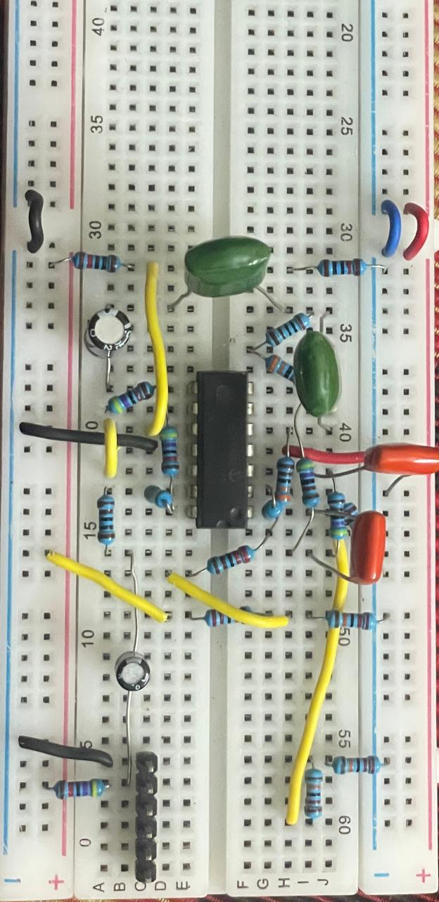
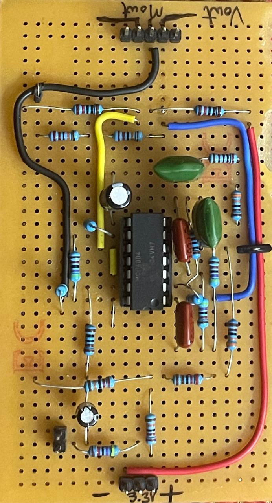
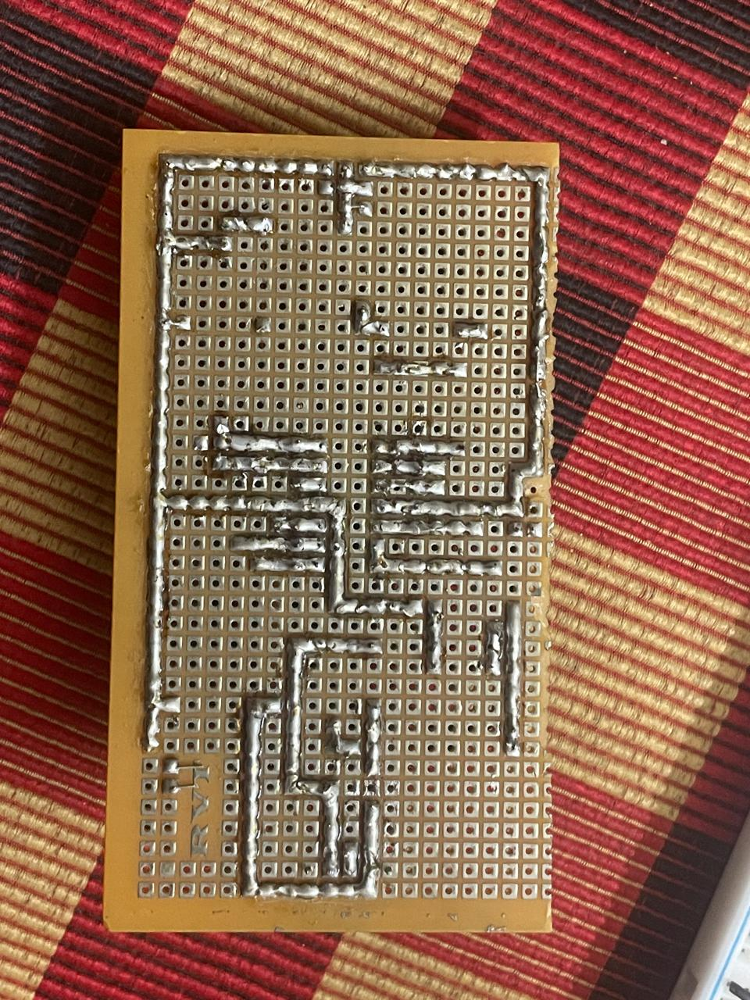
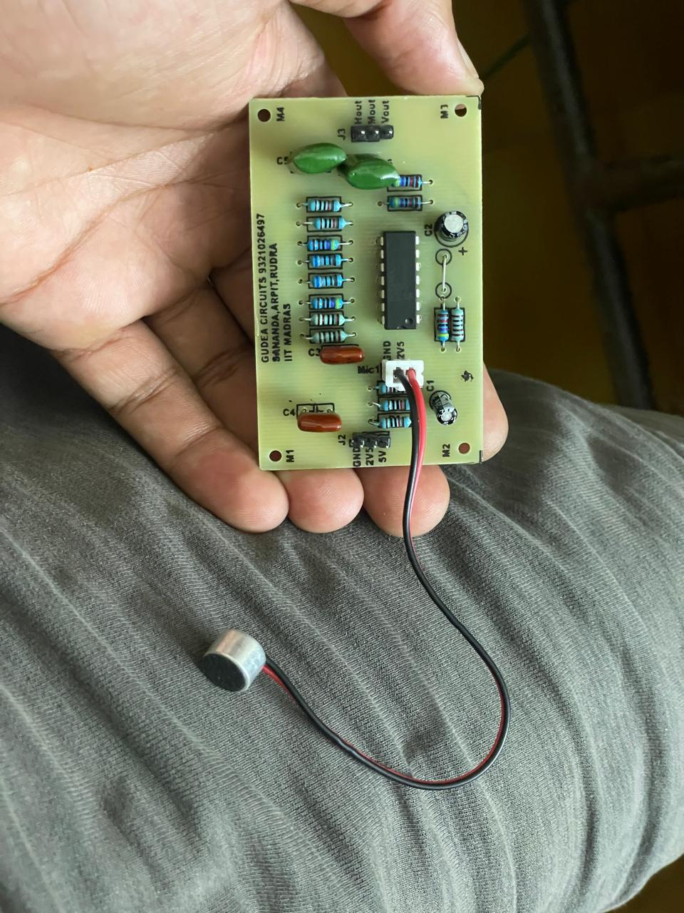
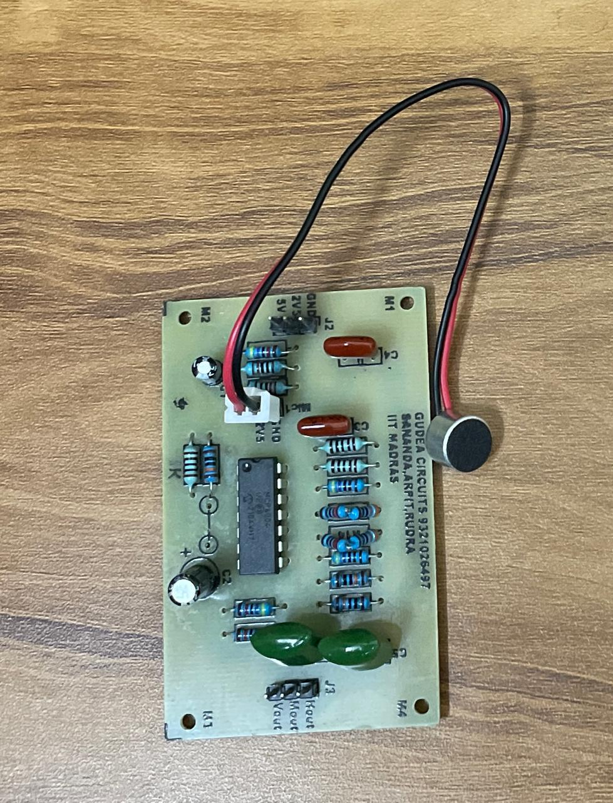
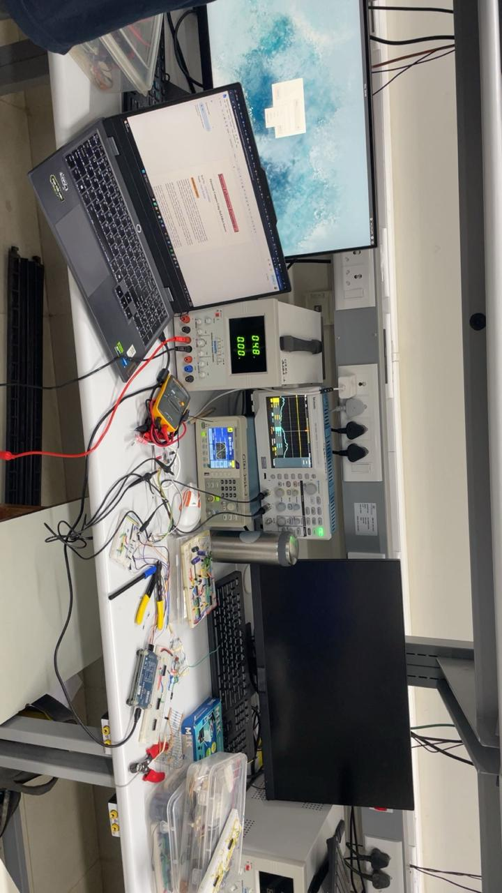
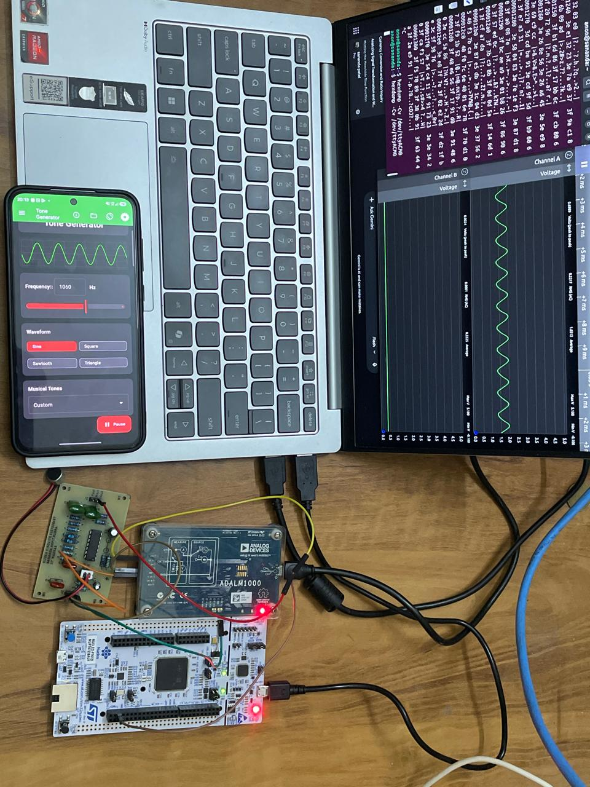
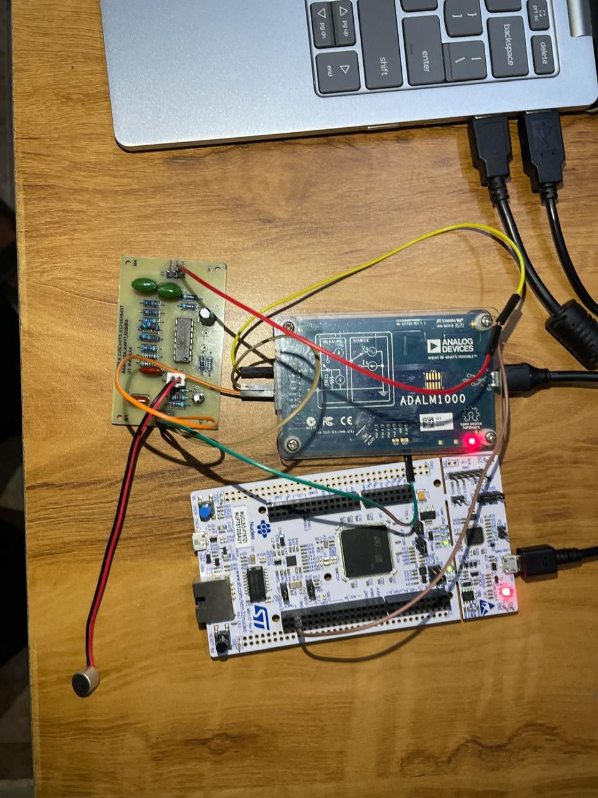
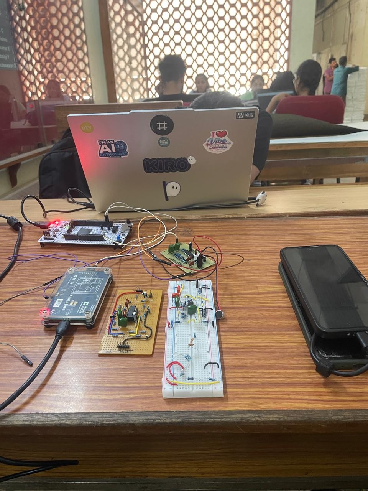

# Real-Time FFT Spectrum Analyzer on STM32 using CMSIS-DSP

[](https://www.st.com)
[](https://arm.com)
[](https://arm-software.github.io/CMSIS_5/DSP/html/index.html)
[](https://www.kicad.org)
[](https://www.iitm.ac.in)
[](https://opensource.org/licenses/Apache-2.0)

An end-to-end embedded digital signal processing (DSP) instrument developed for real-time audio and RF spectral analysis. The system integrates a custom-designed **Telephone-Band (300 Hz – 3400 Hz) Analog Front-End (AFE) PCB**, hardware timer-synchronized **ADC DMA ping-pong double buffering**, hardware-accelerated **1024-point Real Fast Fourier Transform (CMSIS-DSP RFFT)** with Hann windowing, and high-speed binary packet transmission over **UART via DMA at 921,600 baud**.

Developed as part of the **Bachelor of Science in Electronic Systems** curriculum, Department of Electrical Engineering, **Indian Institute of Technology Madras (IIT Madras)**.

📄 **Full Technical Report Available**: [**`docs/Project_Report.pdf`**](docs/Project_Report.pdf)

---

## Academic Credits & Authors

- **Arpit Katiyar** (`ES24f1100064`)
- **Sananda Patel** (`ES24f2100239`)
- **Rudra Raman** (`ES23f3000650`)
- **Project Supervisor**: Mr. Tony Aby Varkey
- **Institution**: Department of Electrical Engineering, Indian Institute of Technology Madras (IIT Madras)

---

## Table of Contents

1. [Key Features](#key-features)
2. [System Architecture & Data Pipeline](#system-architecture--data-pipeline)
3. [Analog Front-End (AFE) Hardware](#analog-front-end-afe-hardware)
4. [Hardware Bring-Up Progression](#hardware-bring-up-progression)
5. [Digital Signal Processing (DSP) Engine](#digital-signal-processing-dsp-engine)
6. [Communication Protocol & Host Interface](#communication-protocol--host-interface)
7. [Experimental Validation & Bench Measurements](#experimental-validation--bench-measurements)
8. [Hardware Wiring & Pinout](#hardware-wiring--pinout)
9. [Project Repository Structure](#project-repository-structure)
10. [Getting Started & Build Instructions](#getting-started--build-instructions)

---

## Key Features

- **Hardware-Timed Sampling**: Precision timer trigger (TIM6 / TIM2 TRGO) driving ADC conversions at a rock-solid **48 kSps / 100 kSps** with zero CPU intervention.
- **Zero-Overhead DMA Streaming**: Circular ping-pong DMA buffering (`DMA1`) seamlessly transfers raw samples into SRAM.
- **Optimized CMSIS-DSP Pipeline**:
  - Dynamic DC offset removal (mean subtraction) to preserve maximum dynamic range at bin 0.
  - Pre-computed 1024-point **Hann window lookup table (LUT)** to suppress spectral leakage.
  - High-performance **Real FFT (`arm_rfft_fast_f32`)** leveraging hardware FPU instructions (single-precision IEEE 754).
  - High-speed Euclidean magnitude calculation (`arm_cmplx_mag_f32`).
  - Coherent-gain and single-sided spectrum amplitude normalization ($X_{\text{norm}}[k] = \frac{2}{N \cdot G_c}|X[k]|$).
- **Cortex-M7 Cache Coherency (STM32F767ZI / STM32G474RE)**:
  - 32-byte cache line alignment for all DMA memory blocks (`__attribute__((aligned(32)))`).
  - Strict MPU memory attributes and targeted cache maintenance (`SCB_InvalidateDCache_by_Addr` and `SCB_CleanDCache_by_Addr`).
- **Non-Blocking Serial Transmission Queue**:
  - 8-slot ring buffer (`TX_QUEUE_DEPTH = 8`) decouples real-time FFT processing from UART DMA output.
  - High baud rate: **921,600 bps** yielding ~44.8 full FFT frames per second.
  - Graceful frame-dropping policy: acquisition and spectral computation are strictly deterministic and never blocked by host transmission bottlenecks.
- **Ultra-Low Processing Latency**:
  - FFT computation execution time: **~150 μs** on Cortex-M7 @ 216 MHz.
  - Complete per-frame DSP pipeline: **~430 μs** (< 2.1% CPU utilization at 48 kSps).

---

## System Architecture & Data Pipeline

```
 [ Electret Microphone ]
           │
           ▼
 ┌────────────────────────────────────────────────────────┐
 │   Analog Front-End (AFE) Signal Conditioning Board      │
 │   - JFET Capsule Biasing & Non-inverting Preamp (6 dB) │
 │   - Active Sallen-Key 2nd-Order HPF (fc ≈ 482 Hz)      │
 │   - Active Sallen-Key 2nd-Order LPF (fc ≈ 3.4 kHz)     │
 │   - Virtual Ground Generator (2.5 V Mid-Supply)        │
 └─────────────────────────┬──────────────────────────────┘
                           │ 300 - 3400 Hz Band-Limited Audio
                           ▼
                 [ STM32 ADC1 Input: PA0 ]
                           │
             Hardware Timer TRGO Trigger (TIM2 / TIM6)
                           │
                           ▼
        ┌──────────────────────────────────────┐
        │  Circular Double-Buffered DMA (SRAM) │
        └──────────────────┬───────────────────┘
                           │
              ┌────────────┴─────────────┐
              ▼                          ▼
       [ Half-Buffer (A) ]        [ Half-Buffer (B) ]
       (1024/512 samples)         (1024/512 samples)
              │                          │
              └────────────┬─────────────┘
                           ▼
              ┌──────────────────────────┐
              │ Dynamic DC Bias Removal  │
              └────────────┬─────────────┘
                           ▼
              ┌──────────────────────────┐
              │ Hann Window Multiplication│
              └────────────┬─────────────┘
                           ▼
              ┌──────────────────────────┐
              │ CMSIS-DSP Real FFT (f32) │
              └────────────┬─────────────┘
                           ▼
              ┌──────────────────────────┐
              │ Euclidean Magnitude &    │
              │ Coherent Gain Norm       │
              └────────────┬─────────────┘
                           ▼
              ┌──────────────────────────┐
              │ Ring Buffer Tx Queue [8] │
              └────────────┬─────────────┘
                           ▼
           USART DMA TX Stream (921,600 Baud)
                           │
                           ▼
          [ Host Visualizer / Python GUI ]
```

---

## Analog Front-End (AFE) Hardware

To condition acoustic voice signals ahead of the microcontroller's ADC, a dedicated analog front-end was designed and realized. The board restricts signals strictly to the **telephone voice channel (300 Hz – 3400 Hz)** in compliance with ITU-T Recommendations P.310 and G.711, serving as an active anti-aliasing filter and low-noise preamplifier.

### Circuit Specifications

| Parameter | Governing Formula | Target Value | Measured / Calculated |
| :--- | :--- | :--- | :--- |
| **Preamplifier Gain ($A_{v1}$)** | $1 + R_{15}/R_{14}$ | $2\text{ V/V}$ ($6.02\text{ dB}$) | $2.0\text{ V/V}$ |
| **Preamplifier HP Corner ($f_{c1}$)** | $1 / (2\pi R_{16} C_6)$ | $< 300\text{ Hz}$ | $15.92\text{ Hz}$ |
| **Unity Inverting Buffer ($A_{v2}$)** | $-R_{11}/R_3$ | $-1\text{ V/V}$ ($0\text{ dB}$) | $-1.0\text{ V/V}$ |
| **2nd-Order Sallen-Key HPF Corner** | $1 / (2\pi\sqrt{R_5 R_6 C_2 C_3})$ | $300\text{ Hz}$ | $482\text{ Hz}$ |
| **HPF Stage Gain ($K_{U4}$)** | $1 + R_9 / R_4$ | $2\text{ V/V}$ | $2.0\text{ V/V}$ |
| **2nd-Order Sallen-Key LPF Corner** | $1 / (2\pi\sqrt{R_7 R_8 C_4 C_5})$ | $3400\text{ Hz}$ | $3390\text{ Hz}$ |
| **LPF Stage Gain ($K_{U6}$)** | $1 + R_{12} / R_{10}$ | $2\text{ V/V}$ | $2.0\text{ V/V}$ |
| **Total Passband Gain ($A_{v,\text{total}}$)** | $A_{v1} \cdot K_{U4} \cdot K_{U6}$ | $8\text{ V/V}$ ($18.06\text{ dB}$) | $8.0\text{ V/V}$ |
| **Active IC** | Single 14-pin DIP Quad Op-Amp | MCP6004-I/P / AD8648 | Rail-to-rail I/O, 1 MHz GBWP |

---

## Hardware Bring-Up Progression

The analog hardware design followed a disciplined, three-stage bring-up progression from schematic to flight-ready hardware:

### 1. Solderless Breadboard Prototyping
Initial circuit validation, component value substitution, and dynamic frequency response verification using laboratory bench signal generators and oscilloscopes.

<p align="center">
  
  <br/>
  <em>Figure 1: Initial solderless breadboard realization of the microphone preamp and active Sallen-Key bandpass filters.</em>
</p>

---

### 2. Hand-Soldered Point-to-Point Perfboard Build
Transition to a ruggedized soldered prototype with an integrated electret capsule microphone and header breakout pins to eliminate loose jumper parasitics.

| Top View (Components & Quad Op-Amp) | Bottom View (Point-to-Point Soldered Traces) |
| :---: | :---: |
|  |  |
| <em>Figure 2a: Hand-soldered perfboard featuring the MCP6004 quad op-amp.</em> | <em>Figure 2b: Reverse side showing hand-routed point-to-point solder joints.</em> |

---

### 3. Professionally Fabricated 2-Layer PCB
The final design was captured in KiCad, routed with dedicated ground-plane copper pours, and fabricated as a dual-layer PCB (**Board Reference GC382**, manufactured by **Gudea Circuits** with silkscreen: `GUDEA CIRCUITS 9321026497 / SANANDA, ARPIT, RUDRA / IIT MADRAS`).

| Populated Custom PCB (Handheld View) | Populated PCB on Bench with Electret Mic |
| :---: | :---: |
|  |  |
| <em>Figure 3a: Custom dual-layer PCB showing test headers (J2, J3) and mounting holes.</em> | <em>Figure 3b: PCB integrated with electret capsule microphone for acoustic capture.</em> |

---

## Digital Signal Processing (DSP) Engine

### 1. Dynamic DC Offset Cancellation
The ADC samples are biased around a virtual ground of 2.5 V. To eliminate the overwhelming 0 Hz DC spectral artifact:
$$\mu = \frac{1}{N}\sum_{n=0}^{N-1} x[n], \quad\quad x_{\text{centered}}[n] = x[n] - \mu$$

### 2. Hann Windowing
A 1024-point Hann window is applied in the time domain to taper the frame edges and suppress spectral side-lobe leakage (-31.5 dB peak sidelobe):
$$w[n] = 0.5 \left(1 - \cos\left(\frac{2\pi n}{N-1}\right)\right)$$

### 3. Real Fast Fourier Transform (CMSIS-DSP)
Exploiting the Hermitian symmetry of real input signals ($X[k] = X^*[N-k]$), the CMSIS-DSP `arm_rfft_fast_f32` function computes $N/2 + 1$ unique complex frequency bins in approximately half the operations of a standard complex FFT:
$$\Delta f = \frac{f_s}{N} = \frac{48\,\text{kHz}}{1024} = 46.875\,\text{Hz / bin} \quad\quad (\text{or } 97.66\,\text{Hz / bin at } 100\,\text{kSps})$$

### 4. Euclidean Magnitude & Amplitude Normalization
Complex frequency bins are converted to physical amplitude spectral density:
$$|X[k]| = \sqrt{\text{Re}\{X[k]\}^2 + \text{Im}\{X[k]\}^2}$$
$$X_{\text{norm}}[k] = \frac{2}{N \cdot G_c}|X[k]| = \frac{|X[k]|}{256} \quad (\text{for } N=1024,\, G_c = 0.5)$$

---

## Communication Protocol & Host Interface

The firmware continuously streams 512 magnitude bins over UART at **921,600 baud (8N1)** packed into structured binary frames:

```c
typedef struct __attribute__((packed)) {
    uint32_t header;            // Magic synchronization word: 0xA55AA55A
    uint32_t frame_id;          // Monotonically increasing frame sequence counter
    uint16_t fft_bins;          // Total magnitude bins transmitted (512)
    uint16_t reserved;          // Reserved for future extensions (0x0000)
    float    magnitude[512];    // 512 single-precision IEEE 754 float values
} FFTPacket_t;
```

- **Packet Length**: $4 + 4 + 2 + 2 + (512 \times 4) = \mathbf{2060\text{ bytes}}$.
- **Effective Transfer Rate**: $\frac{921600\text{ bits/s}}{10\text{ bits/byte}} = 92160\text{ bytes/s} \implies \approx \mathbf{44.8\text{ frames/second}}$.

---

## Experimental Validation & Bench Measurements

The full hardware-software signal chain was characterized in the lab using an **Analog Devices ADALM1000** active learning module, **Rigol Digital Storage Oscilloscopes**, **Agilent Signal Generators**, and a smartphone running a calibrated audio tone generator.

### Complete Laboratory Bench Instrumentation

<p align="center">
  
  <br/>
  <em>Figure 4: Full laboratory setup featuring digital oscilloscope, function generator, precision DC power supply, laptop, and bring-up prototypes.</em>
</p>

---

### End-to-End System Verification (1060 Hz Sinusoidal Tone)

A calibrated 1060 Hz sinusoidal acoustic tone was generated into the electret microphone. The processed output was verified across three domains simultaneously:
1. **Time Domain**: Analog Devices ADALM1000 displaying live captured waveforms in PixelPulse2.
2. **Frequency Domain**: Real-time FFT packet transmission confirmed via raw serial byte inspection (`hexdump -Cv /dev/ttyACM0`).
3. **Firmware Execution**: NUCLEO board streaming frames continuously with zero lockups.

<p align="center">
  
  <br/>
  <em>Figure 5: Live experimental validation — Phone tone generator (1060 Hz), ADALM1000 oscilloscope traces, terminal UART hexdump, and STM32 microcontroller.</em>
</p>

---

### Hardware Interconnect & Prototyping Bench

| Close-Up System Interconnect | Complete Prototyping Bench Overview |
| :---: | :---: |
|  |  |
| <em>Figure 6a: Close-up wiring between custom PCB headers (J2, J3), ADALM1000, and STM32 Nucleo.</em> | <em>Figure 6b: Co-existence of breadboard, perfboard, PCB, and development boards during testing.</em> |

---

## Hardware Wiring & Pinout

| Pin | STM32 Peripheral | Function / Signal | Connection |
| :--- | :--- | :--- | :--- |
| **PA0** | `ADC1_IN1` | Analog In | Connect to **Vout** on AFE PCB header J3 |
| **PA2** / **PD8** | `USART2_TX` / `USART3_TX` | Serial Transmit | ST-LINK VCP UART (921,600 baud) |
| **PA3** / **PD9** | `USART2_RX` / `USART3_RX` | Serial Receive | ST-LINK VCP UART |
| **PA5** / **PB0** | `GPIO_Output` | Status Indicator | User LED (LD1 / LD2) |
| **PC13** | `GPIO_Input` | Pushbutton | User Button B1 (mode toggle) |
| **+5V** / **+3.3V** | Power Rails | Supply Voltage | Connect to AFE PCB header J2 |
| **GND** | System Ground | Ground Reference | Common ground with AFE PCB |

---

## Python Real-Time Spectrum Visualizer

A lightweight Python visualizer parses the 2060-byte binary packet stream and plots the real-time spectrum using `matplotlib`:

```python
import struct
import serial
import numpy as np
import matplotlib.pyplot as plt

PORT = "COM3"           # Adjust for your ST-Link VCP port (or /dev/ttyACM0 on Linux)
BAUD = 921600
HEADER = 0xA55AA55A
BINS = 512
SAMPLE_RATE = 48000     # 48000 Hz or 100000 Hz

ser = serial.Serial(PORT, BAUD, timeout=1)
freqs = np.linspace(0, SAMPLE_RATE / 2, BINS)

plt.ion()
fig, ax = plt.subplots(figsize=(10, 5))
line, = ax.plot(freqs, np.zeros(BINS), color='cyan', lw=1.5)
ax.set_facecolor('#111111')
fig.patch.set_facecolor('#222222')
ax.set_ylim(0, 100)
ax.set_xlim(0, SAMPLE_RATE / 2)
ax.set_xlabel("Frequency (Hz)", color='white')
ax.set_ylabel("Normalized Magnitude (V)", color='white')
ax.set_title("Real-Time STM32 Spectrum Analyzer", color='white')
ax.tick_params(colors='white')
ax.grid(True, color='#444444', linestyle='--')

def read_frame():
    while True:
        raw_header = ser.read(4)
        if len(raw_header) < 4:
            continue
        hdr = struct.unpack("<I", raw_header)[0]
        if hdr == HEADER:
            payload = ser.read(4 + 2 + 2 + BINS * 4)
            if len(payload) == (8 + BINS * 4):
                frame_id, bins, _ = struct.unpack("<IHH", payload[:8])
                mags = struct.unpack(f"<{BINS}f", payload[8:])
                return mags

print("Streaming spectrum data... Press Ctrl+C to terminate.")
while True:
    try:
        mag = read_frame()
        if mag:
            line.set_ydata(mag)
            ax.set_ylim(0, max(max(mag) * 1.1, 10))
            plt.pause(0.001)
    except KeyboardInterrupt:
        break

ser.close()
```

---

## Project Repository Structure

```
.
├── Core/                              # Application source & headers (STM32G474RE)
│   ├── Inc/
│   │   ├── main.h                     # Hardware & peripheral configuration macros
│   │   ├── stm32g4xx_hal_conf.h       # STM32 HAL library module enablement
│   │   └── stm32g4xx_it.h             # Interrupt service routine prototypes
│   ├── Src/
│   │   ├── main.c                     # Primary firmware entrypoint & DSP pipeline
│   │   ├── stm32g4xx_hal_msp.c        # Low-level MCU peripheral MSP initialization
│   │   ├── stm32g4xx_it.c             # ISR handlers (DMA, Timer, UART callbacks)
│   │   ├── system_stm32g4xx.c         # Clock tree and core CMSIS initialization
│   │   ├── syscalls.c
│   │   └── sysmem.c
│   └── Startup/
│       └── startup_stm32g474retx.s    # ARM vector table and reset assembly routines
├── Drivers/
│   ├── CMSIS/                         # ARM Cortex-M CMSIS core & DSP library
│   │   └── DSP/                       # Optimized FFT, filtering, complex math
│   ├── BSP/                           # Board Support Package for Nucleo boards
│   └── STM32G4xx_HAL_Driver/          # STMicroelectronics Hardware Abstraction Layer
├── docs/                              # Project documentation & reference material
│   ├── Project_Report.pdf             # Comprehensive Bachelor of Science Project Report (IIT Madras)
│   └── images/                        # High-resolution hardware and experimental test photos
│       ├── 01_solderless_breadboard_prototype.jpeg
│       ├── 02_perfboard_top_view.jpeg
│       ├── 03_perfboard_solder_traces.jpeg
│       ├── 04_fabricated_pcb_handheld.jpeg
│       ├── 05_fabricated_pcb_desk_view.jpeg
│       ├── 06_lab_bench_instruments_setup.jpeg
│       ├── 07_hardware_desk_overview.jpeg
│       ├── 08_team_testing_session.jpeg
│       ├── 09_validation_1060Hz_tone_test.jpeg
│       └── 10_hardware_interconnect_pcb_stm32.jpeg
├── images/                            # Mirror repository images directory
├── ADC_DMA.c                          # High-speed cache-coherent DMA firmware (STM32F767ZI)
├── ppjjjjjjjj.ioc                     # STM32CubeMX graphical pinout & clock tree project
├── STM32G474RETX_FLASH.ld             # Linker script for Flash execution
├── STM32G474RETX_RAM.ld               # Linker script for RAM execution
└── README.md                          # Repository documentation
```

---

## Getting Started & Build Instructions

### Prerequisites

- **IDE**: [STM32CubeIDE](https://www.st.com/en/development-tools/stm32cubeide.html) (v1.14.0 or newer).
- **Compiler**: `arm-none-eabi-gcc` (automatically bundled with STM32CubeIDE).
- **Target Boards**:
  - STMicroelectronics **NUCLEO-G474RE** (Cortex-M4F @ 170 MHz) or
  - STMicroelectronics **NUCLEO-F767ZI** (Cortex-M7 @ 216 MHz).
- **Host Tools**: Python 3.8+ with `pyserial`, `numpy`, and `matplotlib`.

### Building and Flashing

1. **Clone the repository**:
   ```bash
   git clone https://github.com/123Arp/Electronic_System_Project.git
   cd Electronic_System_Project
   ```
2. **Import into STM32CubeIDE**:
   - Navigate to **File** > **Open Projects from File System...**
   - Choose the root directory of the cloned repository.
   - Click **Finish**.
3. **Build the Project**:
   - Select the build configuration (`Debug` or `Release`).
   - Press `Ctrl + B` or click the Hammer icon.
4. **Flash and Debug**:
   - Connect the NUCLEO board to your computer via USB.
   - Click **Run** > **Debug** (`F11`) or the green Play button.
5. **Launch the Visualizer**:
   ```bash
   python -m pip install pyserial numpy matplotlib
   python visualizer.py
   ```

---

## References

1. ARM Ltd., *"CMSIS-DSP Software Library Documentation,"* [arm-software.github.io/CMSIS_5/DSP/html/index.html](https://arm-software.github.io/CMSIS_5/DSP/html/index.html).
2. STMicroelectronics, *"RM0440 Reference Manual: STM32G4 Series 32-bit ARM Cortex-M4 MCUs,"* 2022.
3. STMicroelectronics, *"RM0410 Reference Manual: STM32F76xxx Advanced ARM-Based 32-Bit MCUs,"* 2021.
4. ITU-T, *"Recommendation P.310: Transmission characteristics for telephone-band (300–3400 Hz) digital telephones,"* International Telecommunication Union, 1996.
5. R. P. Sallen and E. L. Key, *"A practical method of designing RC active filters,"* *IRE Transactions on Circuit Theory*, vol. 2, no. 1, pp. 74–85, Mar. 1955.
6. A. V. Oppenheim and R. W. Schafer, *Discrete-Time Signal Processing*, 3rd ed. Prentice Hall, 2009.

---

## License

This firmware and project are distributed under the **Apache 2.0 / BSD 3-Clause License** compatible with ARM CMSIS and STMicroelectronics HAL libraries. See individual source file headers for component-specific terms.
